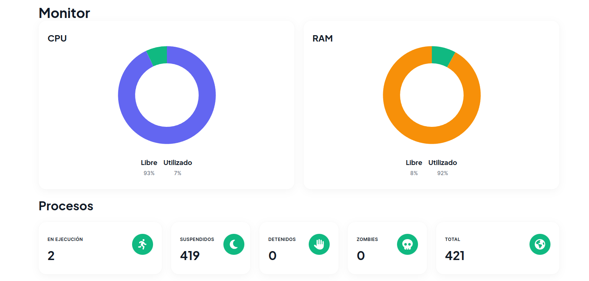
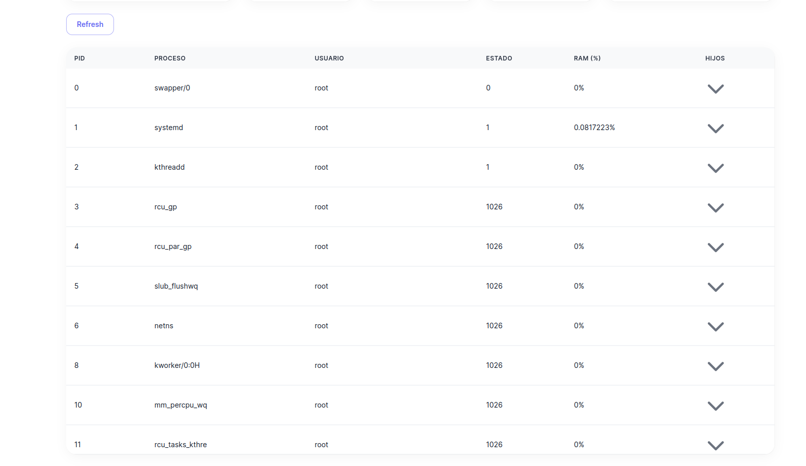
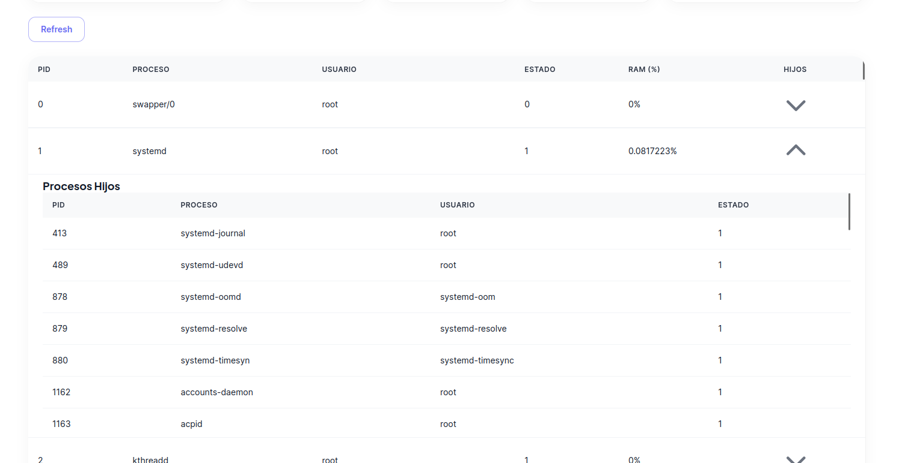

# SO1_PRACTICA2_202010055

La aplicacion consiste en un dashboard donde se puede obtener informacion sobre la memoria RAM y CPU de la computadora mediante llamadas al kernel de esta con modulos escritos en C. Estos datos son posteriormente almacenados en una base de datos de MySQL para luego ser mostrados en una webapp.

La aplcacion se compone de 5 partes:
- Modulos de kernel para lectura de datos de la RAM y CPU
- Aplicacion de Golang para leer los datos recabados
- Base de datos en MySQL para almacenar los datos
- API en Node.js para recuperar los datos de la base de datos
- App en React para mostrar los datos

Estos componentes estaran dentro de contenedores de docker y podran ser levantados en cualquier dispositivo con docker instalado utilizando docker compose.

## Modulos de Kernel
Estos modulos son 2 programas escritos en C que realizaran llamadas al kernel del sistema para obtener informacion del equipo.

### Modulo RAM
Este modulo utilizara la libreria de C ```<linux/sysinfo.h>``` para obtener informacion del estado actual de la memoria RAM.

El modulo de kernel inicia debe de tener 2 metodos principales, uno que le dira que hacer cuando es montado y otro que le dira que hacer cuando es desmontado. Estos son los siguientes:

```C

static int _insert(void)
{
    proc_create("ram_202010055", 0, NULL, &operaciones);
    printk(KERN_INFO "202010055\n");
    return 0;
}

static void _remove(void)
{
    remove_proc_entry("ram_202010055", NULL);
    printk(KERN_INFO "Sistemas_Operativos_1\n");
    
}


module_init(_insert);
module_exit(_remove);
``` 
En este caso, cuando sea montado se imprimira a la infroamcion del Kernel un mensaje y se especificara un struct con las operaciones que realizara el kernel cuando algun programa interactue con el:

```C
static struct proc_ops operaciones =
{
    .proc_open = abrir,
    .proc_read = seq_read
};
``` 
En este caso, cuuando el modulo sea abierto se ejecutara el metodo ```abrir``` y cuando sea leido (por un programa como ```cat```) escribira en la terminal un texto.

Cuando el programa es abierto se debera leer al kernel, esto se hara por medio de la libreria ```<linux/sysinfo.h>```, esta posee un struct llamado ```sysinfo``` donde se puede obtener informacion de la memoria ram.

```C
static int escribir(struct seq_file *archivo, void *v)
{
    struct sysinfo info;
    si_meminfo(&info);
         
    // Buffer, Free, Total, Unit
    seq_printf(archivo, "%lu,%lu,%lu,%d\n",info.bufferram ,info.freeram, info.totalram, info.mem_unit);
    
    return 0;
}
``` 
En este metodo lo primero que se hace es definir una instancia de ```sysinfo```, luego se llama al metodo ```si_meminfo()``` que lo que hara es llenar el ```sysinfo``` con la informacion actual del kernel.

Luego solo se toman los datos que nos concernen y se escriben en el archivo de salida.

### Modulo CPU
Este modulo tendra como funcion obtener informacion del CPU. 

Al igual que el modulo anterior se define las funciones de montado y desmontado del modulo.

```C
static int _insert(void)
{   
    timer_setup(&timer, timer_callback, 0);
    mod_timer(&timer, jiffies + HZ);

    proc_create("cpu_202010055", 0, NULL, &operaciones);
    printk(KERN_INFO "Derek Esquivel\n");
    return 0;
}

static void _remove(void)
{
    del_timer(&timer);

    remove_proc_entry("cpu_202010055", NULL);
    printk(KERN_INFO "Primer Semestre 2023\n");
    
}

module_init(_insert);
module_exit(_remove);

``` 
Con la diferencia que en este caso deberemos iniciar un ```timer```, este tendra como funcion hacer que el proceso ```timer_callback``` se ejecute contantemente cada segundo, la razon de esto sera explicada a continuacion.

La primera parte del modulo sera la de la obtencion de los procesos, para esta  parte se utilizara el struct ```task_struct```, esta posee los datos que necesitamos de cada proceso activo en nuestra computadora.

Para poder listar todos los procesos lo que se hara es recorrer todos los procesos con el ```task_struct```, ya que es posible acceder a los hijos de cada proceso, por lo que empezando desde el proceso 0 se ira recorriendo todo el arbol de procesos mediante llamadas recursivas.

```c
void getProcesses(struct task_struct *task, struct seq_file *archivo) {
	struct task_struct *child;
	struct list_head *list; 
    struct mm_struct *mm;
    unsigned long rss;

    mm = get_task_mm(task);
    if (mm) {
        rss = get_mm_rss(mm) << PAGE_SHIFT;
        mmput(mm);
    }

    long ram = rss / (1024*1024);

    /* Process ID, User ID, Process Name, State, Parent, RAM */
	seq_printf(archivo, "%d,%d,%-20s,%d,%d,%lu\n",task->pid, task->cred->uid,task->comm, task->__state, task->parent->pid, ram);
	list_for_each(list, &task->children) { 
		child = list_entry(list, struct task_struct, sibling);
		getProcesses(child, archivo);
	}
}
``` 

La segunda parte de este modulo sera la que se encargara de obtener la utlizacion actual del CPU. 

En linux, el uso de CPU esta separado en que en cuantos "jiffies" el procesador estuvo ocupado haciendo un trabajo. Estos trabajos estan divididos en:

- usr – CPU usado en procesos en modo usuario
- nice – CPU usado en procesos en modo usuario con la label “nice”
- sys – CPU usado en procesos en modo kernel
- iowait – CPU usado mientras se esperaba por I/O del disco
- irq – CPU usado por interrupciones de hardware
- softirq – CPU usado por interrupciones de software
- steal – CPU cuando el CPU se ve obligado a esperar a que un hipervisor maneje otros procesadores virtuales
- guest – CPU usado al ejecutar un procesador virtual
- idle – CPU usado durante tiempos de inactividad.

Si sumamos todos estos obtendremos cuandos "jiffies" ha utilizado el sistema desde boot.

Para poder saber el CPU utilizado lo que se hara es realizar una lectura inicial de los jiffies

```
     user    nice   system    idle      iowait  irq   softirq  steal  guest  guest_nice
cpu  499251  1384   125547   18945549    8635    0     4578      0      0        0


```
De esta medicion se deberan de sumar todas las columnas para obtener el total de jiffies del CPU, asi como las columnas ```idle``` y ```iowait``` que son las columnas donde el procesador no estuvo realizando ninguna accion

```
PrevTotal = 499251 + 1384 + 125547 + 18945549 + 8635 + 0 + 4578 + 0 + 0 + 0 = 19584944
PrevIdle = 18945549 + 8635 = 18954184

```

Una vez tenemos esta base esperaremos un tiempo (en este caso 1 segundo) para volver a hacer la medicion.

```
     user    nice   system    idle      iowait  irq   softirq  steal  guest  guest_nice
cpu  503544  1384   126540  19171765     8654    0      4618     0      0        0

CurTotal = 503544 + 1384 + 126540 + 19171765 + 8654 + 0 + 4618 + 0 + 0 + 0 = 19811305
CurIdle = 19171765 + 8654 = 19180419

```

Teniendo ambas mediciones se podra calcular la cantidad de jiffies que el procesador ejecuto solamente en este periodo de tiempo restando el primer valor al segundo

```
Total = CurTotal - PrevTotal = 19811305 - 19584944 = 226361
Idle = CurIdle - PrevIdle = 19180419 - 18954184 = 226235
```
Ya teniendo estos valores dividiremos la cantidad de jiffies inacitvos por la cantidad de jiffies totales. Esta division se le restara a 1 y luego se multiplicara por 100 para obtener el porcentaje de utilizacion durante ese lapso de tiempo.

```
CPU% = (1 - (Idle / Total)) * 100 = (1 - (226235 / 226361)) * 100 = 0.05%
```
Ahora procederemos a hacer este proceso en C daremos uso a varias librerias ```<linux/kernel_stat.h>``` para obtener los jiffies de cada trabajo, ```<linux/tick.h>``` para converir los jiffies y ```<linux/timer.h>``` para repetir el proceso cada segundo.

Usaremos ```<linux/kernel_stat.h>``` para obtener los jiffies de cada proceso. Esta libreria nos dara los jiffies por procesador, por lo cual deberemos recorrer todos los procesadores y sumar sus jiffies

```C
for_each_possible_cpu(i) {
    struct kernel_cpustat kcpustat;
    u64 *cpustat = kcpustat.cpustat;

    kcpustat_cpu_fetch(&kcpustat, i);

    user		= cpustat[CPUTIME_USER];
    nice		= cpustat[CPUTIME_NICE];
    system		= cpustat[CPUTIME_SYSTEM];
    idle		= get_idle_time(&kcpustat, i);
    iowait		= get_iowait_time(&kcpustat, i);
    irq		    = cpustat[CPUTIME_IRQ];
    softirq		= cpustat[CPUTIME_SOFTIRQ];
    steal		= cpustat[CPUTIME_STEAL];
    guest		= cpustat[CPUTIME_GUEST];
    guest_nice	= cpustat[CPUTIME_GUEST_NICE];

    user_ = user_ + nsec_to_clock_t(user);
    nice_ = nice_ + nsec_to_clock_t(nice);
    system_ = system_ + nsec_to_clock_t(system);
    idle_ = idle_ + nsec_to_clock_t(idle);
    iowait_ = iowait_ + nsec_to_clock_t(iowait);
    irq_ = irq_ + nsec_to_clock_t(irq);
    softirq_ = softirq_ + nsec_to_clock_t(softirq);
    steal_ = steal_ + nsec_to_clock_t(steal);
    guest_ = guest_ + nsec_to_clock_t(guest);
    guest_nice_ = guest_nice_ + nsec_to_clock_t(guest_nice);
}
``` 

La funcion ```nsec_to_clock_t()``` convertita los jiffies obtenidos con ```kcpustat_cpu_fetch()``` a valores que podemos utilizar.

Luego sumaremos todos los valores para obtener el total asi como los inactivos. Luego realizaremos la resta para la utilizacion actual y almacenaremos los datos en variables global para leerlos en la siguiente ejecucion. Por ultimo reiniciaremos el timer para que se ejecute en un seguno otra vez,

```C
long total = user_ + nice_ + system_ + idle_ + iowait_ + irq_ + softirq_ + steal_ + guest_ + guest_nice_;

long idle_over_period = idle_ - idle_prev ;
long total_over_period = total - total_prev ;

total_prev = total;
idle_prev = idle_;

total_current = total_over_period;
idle_current = idle_over_period;

mod_timer(&timer, jiffies + HZ);
``` 
Para cargar estos modulos al kernel se deberan de compilar con la herramienta ```Make```. Primero se creara un archivo de configuracion:

```
obj-m += cpu_202010055.o
obj-m += ram_202010055.o

all:
	make -C /lib/modules/$(shell uname -r)/build M=$(PWD) modules

clean:
	make -C /lib/modules/$(shell uname -r)/build M=$(PWD) clean

``` 
Luego se utilizara el comando 
```bash
make all
``` 
Esto compilara nuestros archivos .c a .ko, los cuales podremos montar al kernel con el comando:
```bash
sudo insmod <module_name>.ko
``` 

## API Golang
Esta sera un programa que estara corriendo en un ciclo infinito donde hara ```cat``` a los modulos para obtener la informacion y almacenarlos a la base de datos.

Para obtener los datos del modulo de RAM se hara lo siguiente:

```go
usage_ram := 0.0
total_mem := 0.0

cmd := exec.Command("sh", "-c", "cat /proc/ram_202010055")
out, err := cmd.CombinedOutput()
if err != nil {
    fmt.Println(err)
}
output := string(out[:])
r := csv.NewReader(strings.NewReader(output))
for {
    record, err := r.Read()
    if err == io.EOF {
        break
    }
    if err != nil {
        fmt.Println("Here")
        log.Fatal(err)
    }

    buffer_mem, err := strconv.ParseFloat(record[0], 64)
    free_mem, err := strconv.ParseFloat(record[1], 64)
    total_mem, err = strconv.ParseFloat(record[2], 64)
    mem_unir, err := strconv.ParseFloat(record[3], 64)

    buffer_mem = (buffer_mem * mem_unir) / (1024 * 1024)
    total_mem = (total_mem * mem_unir) / (1024 * 1024)
    free_mem = (free_mem * mem_unir) / (1024 * 1024)

    usage_ram = (total_mem - (free_mem + buffer_mem)) / total_mem

    fmt.Printf("Total: %f, Free: %f, Buffer: %f\n", total_mem, free_mem, buffer_mem)
    fmt.Printf("Usado: %f%%\n", usage_ram*100)
}

usage_ram = usage_ram * 100
``` 
Los datos en el modulo estan escritos como un CSV, por lo que se deberan parsear, luego se obtendran todos los valores. Debido a que estos estan datos en unidades de memoria primero se multiplicaran por la unidad de memoria obtenido por sysinfo, luego se dividira por (1024 x 1024) para obtener los valores en Mb.

Luego se leera el modulo del procesador, en este, la primera linea del CSV sera el porcentaje de uso del CPU y en las demas lineas estaran todos los proceso activos.

```go
RUNNING := 0
SUSPENDED := 0
STOPPED := 0
ZOMBIE := 0
TOTAL_P := 0

i := 0

for {
    record, err := r.Read()
    if err == io.EOF {
        break
    }
    if err != nil {
        log.Fatal(err)
    }

    if i == 0 {
        i = 1
        idle, err = strconv.Atoi(record[0])
        total, err = strconv.Atoi(record[1])
        // usage = (1 - (idle / total)) * 100
        continue
    }

    user, err := user.LookupId(record[1])
    if err != nil {
        record[1] = "NULL"
    } else {
        record[1] = user.Username
    }

    fmt.Println(record)

    PID, err := strconv.Atoi(record[0])
    STATE, err := strconv.Atoi(record[3])
    PARENT, err := strconv.Atoi(record[4])
    RAM, err := strconv.Atoi(record[5])
    RAM_P := (float64(RAM) / total_mem) * 100

    sqlStr += "(?, ?, ?, ?, ?, ?),"
    vals = append(vals, PID, record[1], record[2], STATE, PARENT, RAM_P)

    if STATE == 0 {
        RUNNING += 1
    } else if STATE == 4 {
        ZOMBIE += 1
    } else if STATE == 8 {
        STOPPED += 1
    } else {
        SUSPENDED += 1
    }
}

TOTAL_P = RUNNING + ZOMBIE + STOPPED + SUSPENDED

usage_cpu := (1 - (float64(idle) / float64(total))) * 100

fmt.Printf("CPU Usage: %f%%\n", usage_cpu)
``` 

Una vez leidos los datos se pasara a subirlos a la base de datos, primero se hara la conexion:
```C
db, err := sql.Open("mysql", "root:password@tcp(34.121.112.46:3306)/TASK_MANAGER")
defer db.Close()

if err != nil {
    log.Fatal(err)
}
``` 

Una vez nos hemos conectado a la base de datos se subieran los datos. Estos estan en diferentes tablas, los datos del uso de CPU y RAM, asi como los proceso divididos por su estado estaran en una.

```C
sql := fmt.Sprintf("INSERT INTO MONITOR(CPU_FREE, RAM_FREE, RUNNING, SUSPENDED, STOPPED, ZOMBIE, TOTAL) VALUES (%f, %f, %d, %d, %d, %d, %d)", 100-usage_cpu, 100-usage_ram, RUNNING, SUSPENDED, STOPPED, ZOMBIE, TOTAL_P)
		_, err = db.Exec(sql)
		if err != nil {
			panic(err.Error())
		}
``` 
Luego se subiran los proceso, estos seran subidos en batch para no relentizar la aplicacion.

```C
sqlStr := "INSERT INTO PROCESSES(PID, USERNAME, PROCESS_NAME, STATE, PARENT, RAM) VALUES"
vals := []interface{}{}
    ...

sqlStr = sqlStr[0 : len(sqlStr)-1]
stmt, _ := db.Prepare(sqlStr)
stmt.Exec(vals...)
``` 
Los procesos se almacenan en la lista "vals" cada vez que se leen para luego almacenarlos.

## Backend Node.js
Esta sera una simple api en Node con express donde se pediran los datos de la base de datos y se enviaran al frontend.

Primero se importara ```express``` y ```mysql```, luego se configurara la conexion con mysql

```C
const express = require("express");
const mysql = require('mysql')
var cors = require('cors')
var router = express.Router();

const connection = mysql.createConnection({
    host: 'DATABASE_IP',
    user: 'USERNAME',
    password: 'PASSWORD',
    database: 'TASK_MANAGER'
})
``` 

Luego se configuraran tres endpoints, el primero enviara los datos de la tabla Monitor (Uso de CPU, uso de RAM, estado de los procesos)


```js
app.get("/monitor", function(req, res) {
connection.query("SELECT * FROM MONITOR ORDER BY ID DESC LIMIT 1", function (err, data, fields) {
    if(err) return next(new AppError(err))
    res.status(200).json({
        status: "success",
        length: data?.length,
        data: data,
    });
    });
});
```

El segundo sera para enviar todos los procesos:

```js
app.get("/processes", function(req, res) {
  connection.query("SELECT * FROM PROCESSES", function (err, data, fields) {
      if(err) return next(new AppError(err))
      res.status(200).json({
        status: "success",
        length: data?.length,
        data: data,
      });
    });
});
```

Y el tercer solo enviara los proces hijos de un proceso en especifico.
```js
app.get("/processes/:id", function(req, res) {
  connection.query("SELECT * FROM PROCESSES WHERE PARENT = " + req.params.id + " AND PID != PARENT", function (err, data, fields) {
      if(err) return next(new AppError(err))
      res.status(200).json({
        status: "success",
        length: data?.length,
        data: data,
      });
    });
```

# Frontend
Este sera un fronted simple en React. 



Los datos se estaran solicitando cada dos segundos utilizando un effect de react.

```js
useEffect(() => {
    const interval = setInterval(() => {

      fetch('http://127.0.0.1:5000/monitor', {
          method: 'GET',
          headers: {
              'Content-Type':'application/json'
          }
          })
          .then(resp => resp.json())
          .then(data => {
            setCPU([ Math.round(data.data[0].CPU_FREE ),Math.round(100 - data.data[0].CPU_FREE )]) 
            setRAM([ Math.round(data.data[0].RAM_FREE ),Math.round(100 - data.data[0].RAM_FREE )]) 
            setProcesos([data.data[0].RUNNING, data.data[0].SUSPENDED, data.data[0].STOPPED, data.data[0].ZOMBIE, data.data[0].TOTAL])                   
          }).catch(console.error); 

    }, 2000);

    return () => clearInterval(interval);
  }, []);
``` 
Una vez obtenidos los datos seran mostrados en las graficas.

Abajo se mostrara una lista de todos los proceso activos a la hora de realizar la laectura.



Debido a la cantidad de datos que se envian en esta consulta estos no se recibiran cada segundo, si no que se recibiran cuando se recarga la pagina o cuando el usuario presione el boton de "refresh".

```js
const getList = () => {
    fetch('http://127.0.0.1:5000/processes', {
      method: 'GET',
      headers: {
        'Content-Type':'application/json'
      }
    })
    .then(resp => resp.json())
    .then(data => {  
      setListp(data.data)
      console.log(data.data)         
    }).catch(console.error); 
  }

  useEffect(() => {
    getList()
  },[]);
``` 

Asi mismo el usaurio puede observar los proceso hijos del proceso al darle click a la flecha del lado derecho.



Los hijos se pediran con el siguiente metodo    

```js
const getList = event => {

    let id = event.currentTarget.id
    console.log(id)

    fetch('http://127.0.0.1:5000/processes/' + id , {
      method: 'GET',
      headers: {
        'Content-Type':'application/json'
      }
    })
    .then(resp => resp.json())
    .then(data => {  
        console.log(data.data)
        setData(data.data)      
    }).catch(console.error); 

    setOpen(!open)
  }
``` 